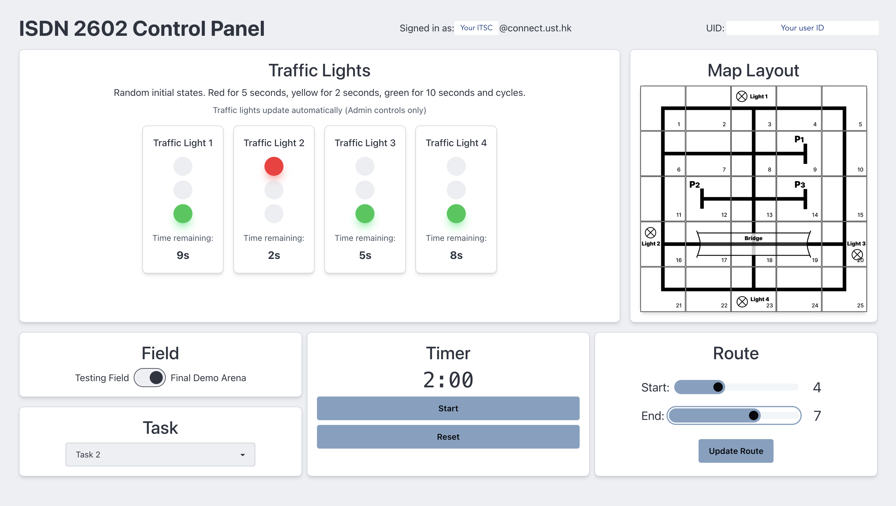

# Control Panel

<!-- TODO - not done -->

We will be using the control panel to config the final demo setting and send commands to your smart cars, including the demo timer, task ID, start and end points, etc. 

The control panel links directly to the Firebase realtime database which your car will be given the WEB API KEY to read off data from it. 

We will also be giving you the access to use the control panel for testing, which your data will be stored under your own user ID, similar to what you have done during the Firebase lab. 

You need to 

1. Sign up and login to the control panel at our Control Panel Site: [panel.isdn2602.site](https://panel.isdn2602.site)
2. Copy your user ID (should be visible at the top right corner of the app)
3. Input the user ID string to your skeleton code (so your car will only read your commands and not be confused by others' commands)
4. (Optional) Turn on the `Serial.print` for retrieving Firebase data and see if the data matches the command you set on your control panel

!!! info

    **Important Notes**

    1. Any attempts to write to the Realtime database other than those allowed on the control panel website is strictly prohibited.
    2. Please only use the control panel when necessary i.e. when you are testing and are physically present at Room 4223.
    3. Please close the website when it is not in use to minimize data traffic.
    4. Please remember your username and password for login. We currently do no provide account retrieval service.
