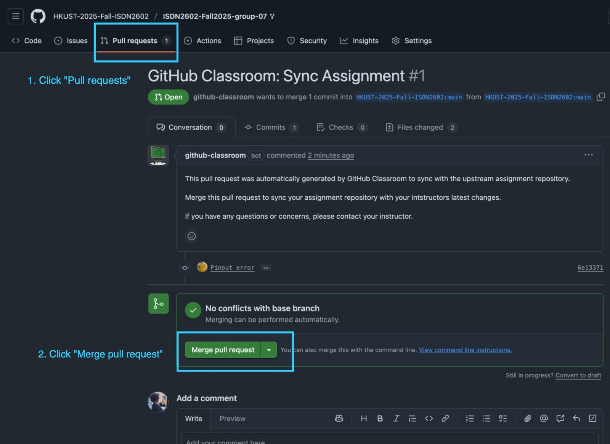

# Welcome

Welcome to the ISDN2602 Final Project Website


## Changelog

#### [2025-11-18] Release of Final Project

#### [2025-11-18 7:35 PM] Ultrasonic Sensor Pin Change

In file `CodeWithFirebase/Pinout.hpp` and `CodeWithoutFireBase/Pinout.hpp` at lines 20 and 21, the ultrasonic sensor pins have been changed as follows:
    
```diff
// Ultrasonic Sensor 
- const uint8_t UltrasonicTrigPin = 6;
+ const uint8_t UltrasonicTrigPin = 39;
- const uint8_t UltrasonicEchoPin = 4;
+ const uint8_t UltrasonicEchoPin = 38;
```

## Notes

If you have already cloned the repository, you will receive a pull request with the updated changes, please refer to the image below to accept and merge the changes. Or you may choose to manually update the code that have been changed.


