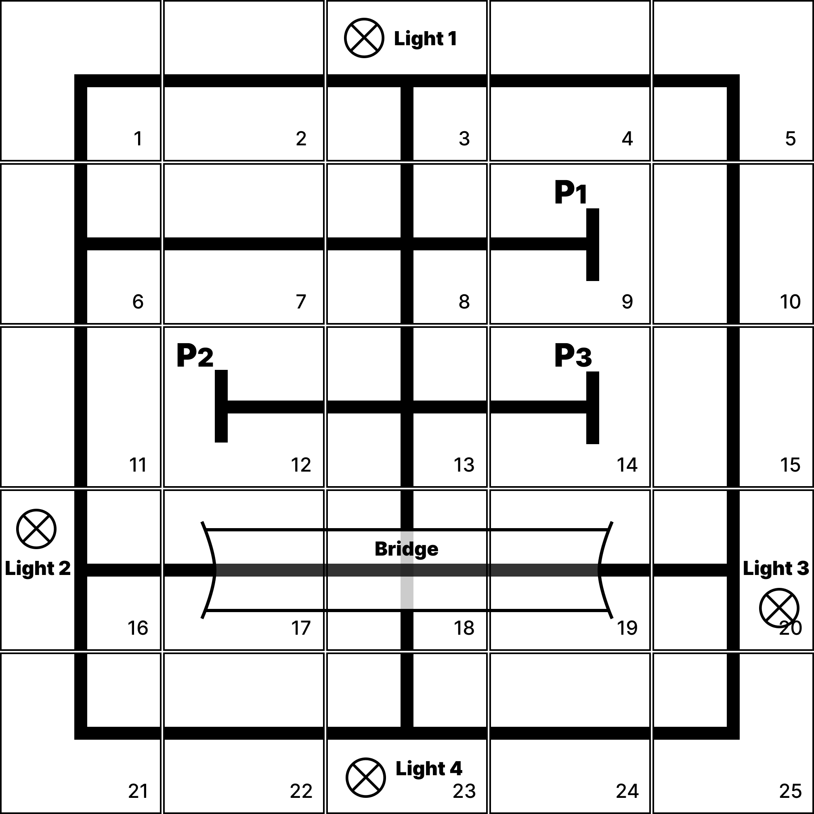
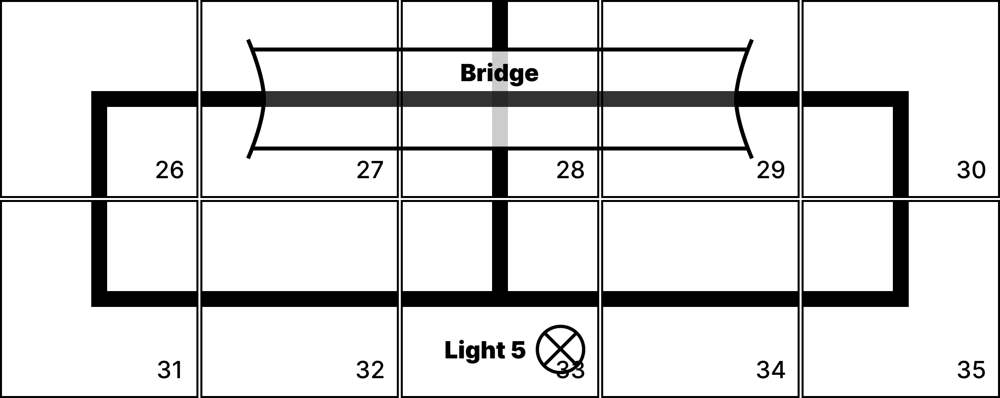

# Map Layout

## Map Layout for Final Project Arena

- For tile board RFID information, please refer to Board IDs from 1 - 25
- For traffic light information, please use traffic light IDs 1 - 4
- The 3 parking slots have been labelled with IDs 1 - 3. You should park the car accordingly to the parking slot at the given end point.

## Map Layout for Testing Field

- For tile board RFID information, please refer to Board IDs from 26 - 35
- For traffic light information, please use traffic light ID 5
