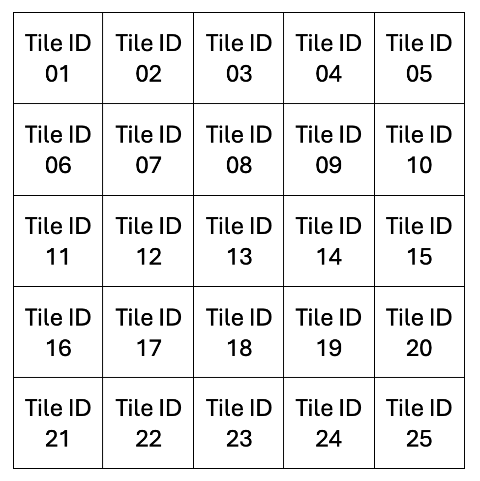
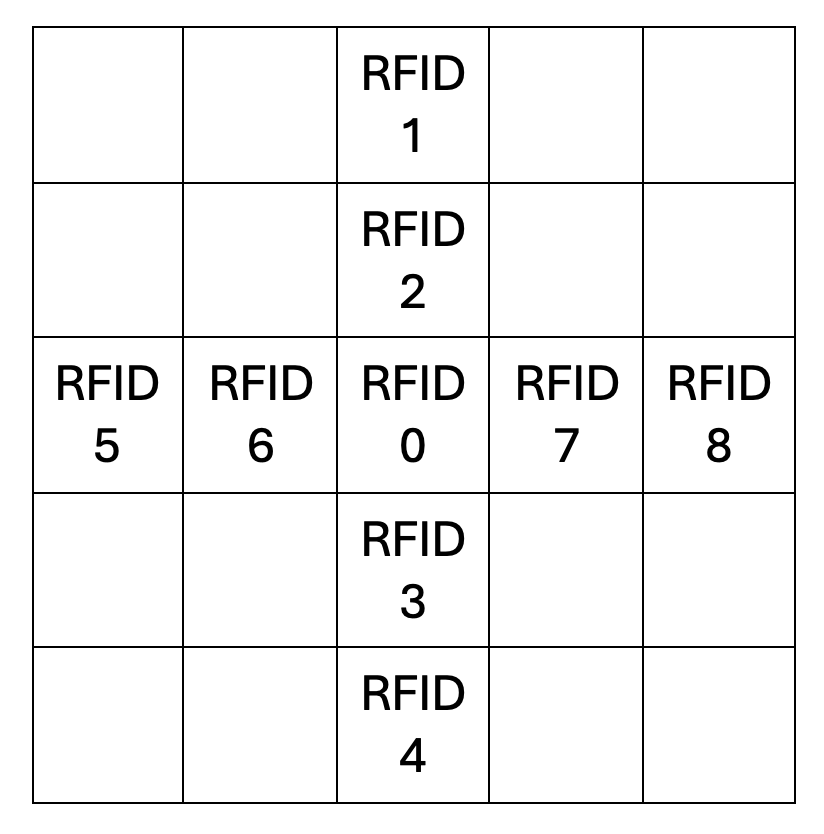

# Tile RFID Reference

Here you can find the RFID tags to all tiles:
[Complete List of all Tiles' RFID](https://hkustconnect-my.sharepoint.com/:x:/g/personal/yzhangqn_connect_ust_hk/EWyJBM4EFmBOosdsIkTaivcBuVgGYlG8TWrE0Jpx9JaBxw?e=xO8tQy)

The final demo arena consists of 5*5 = 25 Tiles with the Tile Board IDs showing below:

Following the same numbering scheme, the testing field consists of 2*5 = 10 Tiles with the Tile Board IDs from 26 to 35.

Each tile consists of 9 RFIDs with the indices showing below:

- 0 as the center RFID
- 1 and 2 for UP direction
- 3 and 4 for DOWN direction
- 5 and 6 for LEFT direction
- 7 and 8 for RIGHT direction

