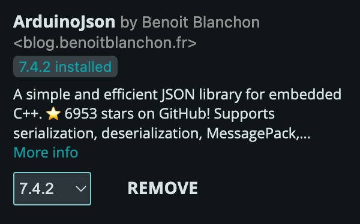

# Firebase related 

## Arduino Libraries Needed to be Installed

FirebaseClient (latest version >= 2.2)

{ width="300" }


ArduinoJson (latest version >= 7.4)

{ width="300" }


## Firebase configuration

In the `config.cpp` file

```cpp
// TODO
// Demo config
const bool demoMode = false;
// Set to true to enable demo mode - to read from examStates data from /admin
// Set to false to read from /users/<uid>/examState when testing by yourself

//...
// TODO
const String USER_EMAIL = "your_email@example.com";
const String USER_PASSWORD = "your_password";
const String UID = "your_unique_user_id";
```

!!! info
    If you have not sign up an account on the control panel website, please checkout [Control Panel](../controlPanel.md) page and follow the instructions there to do so.

- You need to input your email and password for authentication (control panel login info)
- And input your user ID (obtained from the control panel website) to get the examState data from your own path
- During testing you should set the `demoMode` to false to read under your own path with your user ID
- **Before the actual demo day of the final project, you should upload the code with `demoMode = true` in order to receive the examState commands sent from the admin**

## Firebase related code explanation

### Firebase components
```cpp
/*-------------Firebase Components-------------*/
FirebaseApp app;
WiFiClientSecure ssl_client1;
using AsyncClient = AsyncClientClass;
AsyncClient aClient1(ssl_client1);  // For read operations
RealtimeDatabase Database;

// Authentication
UserAuth user_auth(API_KEY, USER_EMAIL, USER_PASSWORD);
```

### Firebase Tasks

#### Inside `void setup()`


```cpp
void setup() {
    // ...
    // Initialize the Wi-Fi Connection
    // LED blinking while connecting to WiFi
    WiFiManager::initialize();
    Serial.println("WiFi Initialized");

    // Configure SSL clients
    ssl_client1.setInsecure();
    ssl_client1.setConnectionTimeout(1000);
    ssl_client1.setHandshakeTimeout(5);

    // Initialize Firebase Realtime Database
    initializeApp(aClient1, app, getAuth(user_auth), processData);
    app.getApp<RealtimeDatabase>(Database);
    Database.url(DATABASE_URL);
    Serial.println("FireBase Initialized");

    // ...
    xTaskCreatePinnedToCore(FirebaseMainTask, "Firebase Main Task", 8192, NULL, 1,
                            &FirebaseMainTaskTCB, 0);
    xTaskCreatePinnedToCore(FirebaseReadTask, "Firebase Read Task", 8192, NULL, 2,
                            &FirebaseReadTaskTCB, 0);

    // ...
    vTaskDelay(10);

}
```

#### Firebase Main Task

#### Firebase Read Task

### Firebase helper function
<!-- TODO - unfinished -->

```cpp
// Firebase heler function to process async results
void processData(AsyncResult &aResult) {
  if (!aResult.isResult()) return;

  //   DEBUG - Log event, debug, and error messages
  //   if (aResult.isEvent())
  //     Firebase.printf("Event task: %s, msg: %s, code: %d\n",
  //                     aResult.uid().c_str(),
  //                     aResult.eventLog().message().c_str(),
  //                     aResult.eventLog().code());

  //   if (aResult.isDebug())
  //     Firebase.printf("Debug task: %s, msg: %s\n", aResult.uid().c_str(),
  //                     aResult.debug().c_str());

  //   if (aResult.isError())
  //     Firebase.printf("Error task: %s, msg: %s, code: %d\n",
  //                     aResult.uid().c_str(),
  //                     aResult.error().message().c_str(),
  //                     aResult.error().code());

  if (aResult.available()) {
    // DEBUG - Log the task and payload
    // Firebase.printf("task: %s, payload: %s\n", aResult.uid().c_str(),
    //                 aResult.c_str());
  }
}
```


If you encounter issue reading data from Firebase, please turn on the `Serial.print` debug info in the `processData` function to see what is going on.

- If you see error message starts with `Error task: ...` or `Debug task: ...`, it usually means there is something wrong with your authentication (email/password) or your user ID is incorrect.
- If you could see the `task: ... payload: ...` message but the payload is empty, it usually means your `examState` or `trafficLights` data is not set correctly on the control panel website or the JSON format parsing process is not done correctly.

