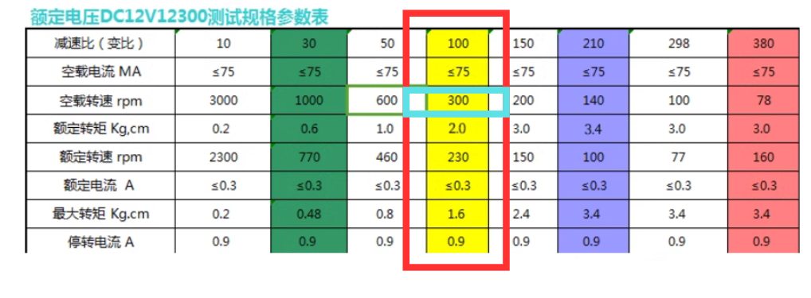

# Motor Control
## Detail code for `MotorControl.hpp` & `MotorControl.cpp`
This section includes the control of the DC motor (Left & right wheel) with the encoder setup to compute the RPM of the DC motor, servo motor (Front wheel).

## DC Motor
### Setting up the PWM Channel(s) for DC motor
For PWM channel, Setting as below. 
PWM: Frequency, Resolution, Dutycycle
Motor: ID, IN1 Channel, IN2 Channel, Speed 

```cpp
namespace MotorControl {
  // Configuration of DC Motor (Side Wheels)
  struct DCMotor
  {
    // PWM Configuration
    const uint16_t PWMFrequency = 2000;
    const uint8_t PWMResolution = 12;
    uint16_t PWMDuty = 0;
    uint8_t MotorID = 0; // ID = 1 (Left), = 2 (Right)
    uint8_t PWMChannelIN1 =
      0; // ensure the PWM channel for different motor is not the same
    uint8_t PWMChannelIN2 = 0;
    // Adjustable Parameter
    uint16_t Speed = 0; // Init set to 0
  }}
```

### The use of `extern`
To give them external linkage and make them accessible across multiple translation units, extern must be explicitly used in their declarations in all files, including the one where they are defined. 
### In `MotorControl.hpp`, 
```cpp
  extern DCMotor LeftWheel;
  extern DCMotor RightWheel;
```
### In `MotorControl.cpp`, 
### Global motor instances
```cpp
namespace MotorControl {
  DCMotor LeftWheel;
  DCMotor RightWheel;

}

```

## Functions for controlling DC motors
```cpp
  namespace DCMotorControl {
  /*Initialization of PWM channels for DC Motors*/
    void Init();
    void TurnClockwise(DCMotor& Motor);
    void TurnAntiClockwise(DCMotor& Motor);
    void Stop(DCMotor& Motor);
  };
```

### `void DCMotorControl::Init()`
```cpp

void MotorControl::DCMotorControl::Init()
{
  // Setup the Motor ID to the struct
  LeftWheel.MotorID = 1;
  LeftWheel.PWMChannelIN1 = 1;
  LeftWheel.PWMChannelIN2 = 2;

  RightWheel.MotorID = 2;
  RightWheel.PWMChannelIN1 = 3;
  RightWheel.PWMChannelIN2 = 4;

  // Setup PWM channels for DC Motors (Side Wheels)
  ledcAttachChannel(Pinout::LeftMotorIn1,
                    LeftWheel.PWMFrequency,
                    LeftWheel.PWMResolution,
                    LeftWheel.PWMChannelIN1);
  ledcAttachChannel(Pinout::LeftMotorIn2,
                    LeftWheel.PWMFrequency,
                    LeftWheel.PWMResolution,
                    LeftWheel.PWMChannelIN2);
  ledcAttachChannel(Pinout::RightMotorIn1,
                    RightWheel.PWMFrequency,
                    RightWheel.PWMResolution,
                    RightWheel.PWMChannelIN1);
  ledcAttachChannel(Pinout::RightMotorIn2,
                    RightWheel.PWMFrequency,
                    RightWheel.PWMResolution,
                    RightWheel.PWMChannelIN2);

  // Set all the PWM Channels' Dutycycle to 0
  ledcWriteChannel(LeftWheel.PWMChannelIN1, 0);
  ledcWriteChannel(LeftWheel.PWMChannelIN2, 0);
  ledcWriteChannel(RightWheel.PWMChannelIN1, 0);
  ledcWriteChannel(RightWheel.PWMChannelIN2, 0);
};
```

## Spinning the DC motor
## Refer to the datasheet of the motor sheet (Motor driver)

Check out URL: https://www.ti.com/lit/ds/symlink/drv8871.pdf?ts=1763316592601&ref_url=https%253A%252F%252Fwww.google.com%252F for the latest docs.


### `void MotorControl::DCMotorControl::TurnClockwise(MotorControl::DCMotor& Motor)` 
@brief Spin the motor clockwise, package the function in struct dependent.

@param Motor (MotorControl::DCMotor& Motor) (i.e. LeftWheel / RightWheel)


```cpp
void MotorControl::DCMotorControl::TurnClockwise(MotorControl::DCMotor& Motor)
{
  ledcWriteChannel(Motor.PWMChannelIN1, Motor.Speed);
  ledcWriteChannel(Motor.PWMChannelIN2, 0);
};
```

### `void MotorControl::DCMotorControl::TurnAntiClockwise(MotorControl::DCMotor& Motor)`
@brief Spin the motor anti-clockwise, package the function in struct dependent.

@param Motor (MotorControl::DCMotor& Motor) (i.e. LeftWheel / RightWheel)
 

```cpp
void MotorControl::DCMotorControl::TurnAntiClockwise(MotorControl::DCMotor& Motor)
{

  ledcWriteChannel(Motor.PWMChannelIN1, 0);
  ledcWriteChannel(Motor.PWMChannelIN2, Motor.Speed);
};
```
### `void MotorControl::DCMotorControl::Stop(MotorControl::DCMotor& Motor)`
@brief Stop the motor, package the function in struct dependent.

@param Motor (MotorControl::DCMotor& Motor) (i.e. LeftWheel / RightWheel)

Refer to the datasheet, to stop the DC motor, both of IN1 and IN2 should be pull-high (100% dutycycle, i.e. 4096 for 12-bit PWM resolution)

```cpp
void MotorControl::DCMotorControl::Stop(MotorControl::DCMotor& Motor)
{
  ledcWriteChannel(Motor.PWMChannelIN1, 4096);
  ledcWriteChannel(Motor.PWMChannelIN2, 4096);
};
```

# Encoder for DC Motor
### Setting up the encoder for DC motor (n20)


* The gearbox used on the car is highlight in red, and the rpm of the motor (without any payload) is 300.

### Creating struct for encoder
To find the rpm of the motor, encoder with A and B is used to detect the rotation of the magnet attaches to the motor. 

In `MotorControl.hpp`, 
```cpp
// Create a struct to handle 2 motors encoder
struct Encoder_t
{
  int pinAState;
  int pinBState;
  int Encoder_A;
  int Encoder_B;
};
```

### Constant for encoder
* encoderResolution is tested by full speed (100% dutycycle) and count the pulses. Since the rpm of the motor without payload is 300, the pulse per rotation of the motor can be found. 
```cpp
/*Constants for Encoder
  Find out the encoder resolution by yourself */
const int encoderResolution = 320; // Number of pulses per revolution
const unsigned long interval = 50; // Time interval in milliseconds 50ms
```

```cpp
// Global motor encoder
extern Encoder_t EncoderLeft;
extern Encoder_t EncoderRight;
```

In `MotorControl.cpp`
```cpp
namespace MotorControl {
  ServoMotor FrontWheel;
}
```

## RPM Counter 
### Setup of the RPM counter struct 
In `MotorControl.hpp`, 
```cpp
/*Encoder to RPM Function and Settings
  Creating RPMCounter_t for 2 Wheel Setting
  */
struct RPMCounter_t
{
  volatile int encoderPulses;
  unsigned long previousMillis;
  volatile float rpm;
};

extern RPMCounter_t LeftWheelRPM;
extern RPMCounter_t RightWheelRPM;
```

## Functions for encoder
* Interrupts are used for the triggering of the encoder pin 

```cpp
namespace Encoder {
  /*Interrupt for the encoder for both left & right wheel*/
  void handleLeftEncoderInterrupt();
  void handleRightEncoderInterrupt();
  void Init();
  void RPMCounterFromEncoder(RPMCounter_t& Counter);
};
```
### Initalization of RPM counter
In `MotorControl.cpp`, 
```cpp
/*Init the Enocoder related Variables before the task starts*/
Encoder_t EncoderLeft = { 0,
                          0,
                          Pinout::LeftMotorEncoderA,
                          Pinout::LeftMotorEncoderB };
Encoder_t EncoderRight = { 0,
                           0,
                           Pinout::RightMotorEncoderA,
                           Pinout::RightMotorEncoderB };

/*Define 2 Sets of Variables using RPMCounter_t for 2 Wheel
Init the RPM related Variables before the task starts   */
RPMCounter_t LeftWheelRPM = { 0, 0, 0 };
RPMCounter_t RightWheelRPM = { 0, 0, 0 };
```

## Impentation of interrupt in ESP32 
For the detail API of  `IRAM_ATTR`, please refer to the offical documentation in esp32 website. 

URL: https://docs.espressif.com/projects/esp-idf/en/stable/esp32/api-guides/memory-types.html 

In `MotorControl.cpp`, `Encoder` namespace, 
### `void IRAM_ATTR Encoder::handleLeftEncoderInterrupt()`
```cpp
/*Interrupt Service Routine Function
  Since attachInterrupt() cannot using non Static function
  Below are 2 IRAM_ATTR function for handle the interrupts for the encoder*/
namespace Encoder {
  void IRAM_ATTR handleLeftEncoderInterrupt()
  {
    // init the local variable
    int change = 0;

    // Read the current state of the encoder pins
    EncoderLeft.pinAState = digitalRead(EncoderLeft.Encoder_A);
    EncoderLeft.pinBState = digitalRead(EncoderLeft.Encoder_B);

    // Determine the direction of rotation based on the phase change
    if (EncoderLeft.pinAState != EncoderLeft.pinBState) {
      change = (EncoderLeft.pinAState == HIGH) ? 1 : 0;
    } else {
      change = (EncoderLeft.pinAState == HIGH) ? 0 : 1;
    }

    // Update the encoder count
    LeftWheelRPM.encoderPulses += change;
  };
  ```

### `void IRAM_ATTR Encoder::handleRightEncoderInterrupt()`
  ```cpp
  void IRAM_ATTR handleRightEncoderInterrupt()
  {
    // init the local variable
    int change = 0;

    // Read the current state of the encoder pins
    EncoderRight.pinAState = digitalRead(EncoderRight.Encoder_A);
    EncoderRight.pinBState = digitalRead(EncoderRight.Encoder_B);

    // Determine the direction of rotation based on the phase change
    if (EncoderRight.pinAState != EncoderRight.pinBState) {
      change = (EncoderRight.pinAState == HIGH) ? 1 : 0;
    } else {
      change = (EncoderRight.pinAState == HIGH) ? 0 : 1;
    }

    // Update the encoder count
    RightWheelRPM.encoderPulses += change;
  };
  ```

### `Encoder::Init()`
* Initialization of ALL the GPIO pins for encoder. 
* Attach the interrupts to MCU, which to tell MCU to enable the interrupts.
```cpp
  void Init()
  {
    // Init the PinMode for the Encoder Pins
    pinMode(Pinout::LeftMotorEncoderA, INPUT_PULLUP);
    pinMode(Pinout::LeftMotorEncoderB, INPUT_PULLUP);

    pinMode(Pinout::RightMotorEncoderA, INPUT_PULLUP);
    pinMode(Pinout::RightMotorEncoderB, INPUT_PULLUP);

    // Attach the interrupt service routine to the encoder pins
    attachInterrupt(digitalPinToInterrupt(Pinout::LeftMotorEncoderA),
                    handleLeftEncoderInterrupt,
                    CHANGE);
    attachInterrupt(digitalPinToInterrupt(Pinout::RightMotorEncoderA),
                    handleRightEncoderInterrupt,
                    CHANGE);
    Serial.println("Interrupt Pins Initialized");
  };
```


### `void Encoder::RPMCounterFromEncoder(RPMCounter_t& Counter)`
@brief Take the encoder reading in a period of time and convert the data to RPM and store the data in the `RPMCounter_t` structure.

@para `RPMCounter_t&` -- RPM Counter struct (i.e. `LeftWheelRPM`/`RightWheelRPM`)
```cpp
  void RPMCounterFromEncoder(RPMCounter_t& Counter)
  {
    unsigned long currentMillis = millis();

    // Check if the time interval has elapsed
    if (currentMillis - Counter.previousMillis >= interval) {
      // Calculate RPM
      float rotations = float(Counter.encoderPulses) / ((float)encoderResolution);
      float time =
        (currentMillis - Counter.previousMillis) / 1000.0f; // Convert to seconds
      Counter.rpm = (rotations / time) * 60.0f;

      // Reset encoder pulse count and update previousMillis
      Counter.encoderPulses = 0;
      Counter.previousMillis = currentMillis;

      // Print RPM
      Serial.println(Counter.rpm);
    }
  }
}
```


# Servo Motor
### Setting up Servo Motor PWM Channel
For Servo Motor, Frequency MUST be 50Hz
Servo Motor: Target angle
```cpp
  // Configuration of Servo Motor (Front Wheel)
  struct ServoMotor
  {
    const uint8_t PWMFrequency = 50; // PWM must be in 50Hz
    const uint8_t PWMResolution = 12;
    uint16_t PWMDuty = 0;
    const uint8_t PWMChannel = 8; // Ideally select between 5-10
    float TargetAngle = 0.0f;
  };

  ServoMotor FrontWheel;
```
## Functions for servo motor (Front wheel)
```cpp
  namespace ServoMotorControl {
    /*Initialization of PWM Channel for Servo Motor*/
    void Init();
    void TurnDeg(ServoMotor& Motor); // in deg
  }
  // Global motor instances


  extern ServoMotor FrontWheel;
```

### `void MotorControl::ServoMotorControl:Init()`
@brief Initalization of the PWM channel for servo motor.

```cpp
void MotorControl::ServoMotorControl::Init()
{
  // Setup PWM channel for Servo Motor (Front Wheel)
  ledcAttachChannel(Pinout::ServoPin,
                    FrontWheel.PWMFrequency,
                    FrontWheel.PWMResolution,
                    FrontWheel.PWMChannel);
  // Set all the PWM Channels' Dutycycle to 0
  ledcWriteChannel(FrontWheel.PWMChannel, 0);
};
```

### `void MotorControl::ServoMotorControl::TurnDeg(MotorControl::ServoMotor& Motor)`
@brief Control the PWM dutycycle to adjust the angle of the servo motor (Frontwheel)

@para `MotorControl::ServoMotor& Motor` The struct of the servo motor (i.e. FrontWheel)

```cpp
/*For SG90 Servo Motor
PWM         --> 50Hz  (20ms)
Dutycycle   --> 1-2ms (5-10%)*/
void MotorControl::ServoMotorControl::TurnDeg(MotorControl::ServoMotor& Motor)
{
  Motor.PWMDuty = (float(Motor.TargetAngle) / 90.0f) * 51.2f + 25.0f;
  ledcWriteChannel(Motor.PWMChannel, Motor.PWMDuty);
  /*For Debug*/
  // Serial.print("Servo Degree: ");
  // Serial.println(Degree);
  // Serial.print("Dutycycle: ");
  // Serial.println(Dutycycle);
};
```
