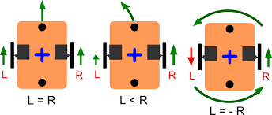

# Movement
## Detail code for `Movement.hpp` and `Movement.cpp`
### Declartions of configuration of angle of the car

```cpp
namespace Movement {
    // Servo positions
    /*Servo Physical Config on Car in deg
          45  90  135   
            \  |  /              
             \ | /
              \|/ 
       0 ------------- 180        */
    const uint8_t servoLeft   = 45;
    const uint8_t servoCenter = 90;
    const uint8_t servoRight  = 135;
}
```

### Functions of controlling the car movements
Creating the motion by utilizing front, left, right wheel rotations. 

The following function is based on differental drive when `L = -R` (see the fig.)



In `Movement.hpp`,
```cpp
namespace Movement {
    void RotateLeft();
    void RotateRight();
    void MoveForward();
    void MoveBackward();
    void Stop();
}
```

## `void Movement::RotateRight()`
@brief Make the car turns right. 
```cpp
    void Movement::RotateRight(){
        /*The following config is for differential driving, i.e. Front Wheel always 90 deg facing forward */
        /*Config. of DC Motor (Side Wheel)*/
        MotorControl::DCMotorControl::TurnAntiClockwise(MotorControl::LeftWheel);
        MotorControl::DCMotorControl::TurnClockwise(MotorControl::RightWheel);

        /*Setting the servo motor to 90 deg */
        MotorControl::FrontWheel.TargetAngle = servoCenter;
        MotorControl::ServoMotorControl::TurnDeg(MotorControl::FrontWheel);
    };
```

## `void Movement::Rotateleft()`
@brief Make the car turns left. 
```cpp
    void Movement::RotateLeft(){
        /*The following config is for differential driving, i.e. Front Wheel always 90 deg facing forward */
        /*Config. of DC Motor (Side Wheel)*/
        MotorControl::DCMotorControl::TurnClockwise(MotorControl::LeftWheel);
        MotorControl::DCMotorControl::TurnAntiClockwise(MotorControl::RightWheel);

        /*Setting the servo motor to 90 deg */
        MotorControl::FrontWheel.TargetAngle = servoCenter;
        MotorControl::ServoMotorControl::TurnDeg(MotorControl::FrontWheel);
    };
```

## `void Movement::MoveForward()`
@brief Make the car moves forwards.
```cpp
    void Movement::MoveForward(){
        /*The following config is for differential driving, i.e. Front Wheel always 90 deg facing forward */
        /*Config. of DC Motor (Side Wheel)*/
        MotorControl::DCMotorControl::TurnAntiClockwise(MotorControl::LeftWheel);
        MotorControl::DCMotorControl::TurnAntiClockwise(MotorControl::RightWheel);


        /*Setting the servo motor to 90 deg */
        MotorControl::FrontWheel.TargetAngle = servoCenter;
        MotorControl::ServoMotorControl::TurnDeg(MotorControl::FrontWheel);
    };
```
## `void Movement::MoveBackward()`
@brief Make the car moves backwards. 
```cpp
    void Movement::MoveBackward(){
        /*The following config is for differential driving, i.e. Front Wheel always 90 deg facing forward */
        /*Config. of DC Motor (Side Wheel)*/
        MotorControl::DCMotorControl::TurnClockwise(MotorControl::LeftWheel);
        MotorControl::DCMotorControl::TurnClockwise(MotorControl::RightWheel);

        /*Setting the servo motor to 90 deg */
        MotorControl::FrontWheel.TargetAngle = servoCenter;
        MotorControl::ServoMotorControl::TurnDeg(MotorControl::FrontWheel);
    };
```

## `void Movement::Stop()`
@brief Make the car stops.
```cpp
    void Movement::Stop(){
        MotorControl::DCMotorControl::Stop(MotorControl::LeftWheel);
        MotorControl::DCMotorControl::Stop(MotorControl::RightWheel);
    }
```

## Adjust the speed of motion 
Refer to the `motor.md`, the functions in `MotorControl.hpp` are used.

Since the struct of the motor (LeftWheel & RightWheel) are created. There is a member in the `DCMotor` called `speed`. 

By adjusting the `speed` of `LeftWheel` & `RightWheel`, the speed of the movement can be changed. 

### With PID control
In the `.ino`, (With PID driver)

For the detail of the PID control, please refer to the `PID Section`. 

The following code is an example of the car moves forwards.

@para `LeftWheelPID.target_val` Target speed of the leftwheel 

@para `RightWheelPID.target_val` Target speed of the rightwheel

For an instance, both speed of the wheel fixed to `150.0f`. 
```cpp
        LeftWheelPID.target_val = 150.0f;
        RightWheelPID.target_val = 150.0f;
        Movement::MoveForward();
        vTaskDelay(100/portTICK_PERIOD_MS); //delay for a duration of 100ms 
        //or use delay(100);
```

If a faster speed is needed, increase the value of `LeftWheelPID.target_val` & `RightWheelPID.target_val`. 
```cpp
        LeftWheelPID.target_val = 300.0f;
        RightWheelPID.target_val = 300.0f;
        Movement::MoveForward();
        vTaskDelay(100/portTICK_PERIOD_MS); //delay for a duration of 100ms 
        //or use delay(100);
```
